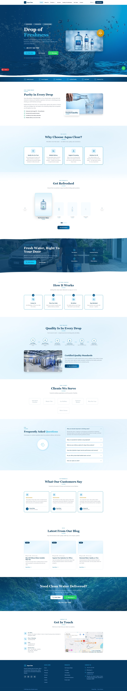

# 💧 Aqua Clear — Premium Bottled Drinking Water

<div align="center">

[](https://nextjs.org/)
[](https://www.typescriptlang.org/)
[](https://tailwindcss.com/)
[](https://www.framer.com/motion/)
[](https://vercel.com/)

**Pure Water. Pure Confidence.**  
*A modern, high-performance web experience for Pakistan's premier bottled drinking water brand.*

[Screenshot](#-website-preview) • [Features](#-key-features) • [Tech Stack](#-tech-stack) • [Quick Start](#-quick-start) • [Roadmap](#-future-roadmap)

<br /><br />

<a href="https://aquaclear-three.vercel.app/" target="_blank">
  
</a>

</div>

---

## 📸 Website Preview

<div align="center">
  <a href="https://aquaclear-three.vercel.app/" target="_blank">
    
  </a>
</div>

---

## ✨ Key Features

| Category | Capabilities & Implementation |
|---|---|
| 🍾 **Product Catalog** | High-res transparent bottle media for **19L**, **12L**, **1.5L**, and **500ml** sizes with specifications and recommended use cases. |
| 🎠 **Interactive Carousel** | Smooth scaling and carousel navigation with micro-animations built using Framer Motion. |
| 🎥 **Video Storytelling** | Native embedded video player on the **About Us** page with autoplay, loop, and responsive aspect ratio. |
| 📜 **PFA Certification** | Official **Punjab Food Authority (PFA)** licensing showcase with an interactive high-resolution certificate modal viewer. |
| 🗺️ **Interactive Maps** | Embedded Google Map for the Airport Housing Society, Rawalpindi / Islamabad hub, plus quick one-tap external navigation. |
| 📱 **Instant Ordering** | Direct **WhatsApp integration** (`+92 311 122 7767`) with pre-filled order messages and custom modal order forms. |
| 🎨 **Water Design System** | Custom color palette (`#063A63` Deep Blue, `#29B6E6` Water Blue), SVG wave transitions, glassmorphism, and Playfair Display typography. |

---

## 🛠 Tech Stack

- **Framework**: [Next.js 16 (App Router)](https://nextjs.org/) with Turbopack for lightning-fast builds
- **Language**: [TypeScript](https://www.typescriptlang.org/) for complete type safety
- **Styling**: [Tailwind CSS v4](https://tailwindcss.com/) with CSS variables and custom utility classes
- **Animations**: [Framer Motion](https://www.framer.com/motion/) for fluid page entries and hover micro-interactions
- **Icons**: [Lucide React](https://lucide.dev/) + Custom SVG social badges
- **Validation**: [Zod](https://zod.dev/) & [React Hook Form](https://react-hook-form.com/) for reliable contact & order processing
- **Deployment Target**: [Vercel](https://vercel.com/) (Zero-configuration serverless deployment)

---

## 📁 Project Structure

```text
aqua-clear-site/
├── public/                 # Static web assets served by Vercel
│   ├── images/             # Background textures, hero splashes, and purification plant
│   └── media/              # High-res bottle PNGs, About Us video, and PFA license
├── Screenshots/            # Full-page high-resolution website screenshots
│   └── Screenshot.jpeg     # 1794 x 9701 full webpage render
├── src/
│   ├── app/                # Next.js App Router pages
│   │   ├── about/          # Company story, mission, and video showcase
│   │   ├── contact/        # Contact cards, form, and Google Maps iframe
│   │   ├── products/       # Product catalog & [slug] dynamic detail pages
│   │   ├── quality/        # Multi-stage purification & PFA license modal
│   │   ├── services/       # Home & office bulk delivery packages
│   │   └── team/           # Leadership and water quality specialists
│   ├── components/         # Reusable UI components & section blocks
│   │   ├── forms/          # OrderForm, ContactForm, ApplicationForm
│   │   ├── layout/         # Responsive Navbar & rich Footer
│   │   ├── sections/       # Hero, ProductShowcase, QualityPreview, etc.
│   │   └── ui/             # Modal, ProductCard, SectionHeading, etc.
│   ├── config/             # Centralized site info, contact details & product data
│   └── types/              # TypeScript interfaces and data definitions
└── README.md
```

---

## 🚀 Quick Start

### 1. Clone & Install

```bash
git clone https://github.com/theikram/AquaClear.git
cd AquaClear
npm install
```

### 2. Run Development Server

```bash
npm run dev
```

Visit `http://localhost:3000` in your browser.

### 3. Production Build

```bash
npm run build
npm run start
```

---

## 🌐 Deploying to Vercel

1. Push this repository to GitHub.
2. Go to [Vercel](https://vercel.com/new) and click **Import Project**.
3. Select your `AquaClear` repository.
4. Leave framework presets as **Next.js** (all media and environment assets are self-contained in `public/`).
5. Click **Deploy**. Your site will be live on a global CDN within 60 seconds!

---

## 🔮 Future Roadmap

- [ ] **Urdu Localization (`EN / UR`)**: Complete language toggle with RTL (Right-to-Left) typography support for Pakistani consumers.
- [ ] **Headless CMS / Media Manager**: Admin portal to update banner promotions, bottle sizes, and seasonal discounts without redeploying code.
- [ ] **Automated WhatsApp Bot**: Integration with WhatsApp Business Cloud API to automatically parse orders and confirm delivery slots.
- [ ] **Recurring Delivery Subscriptions**: Customer portal for weekly or monthly scheduled water refills for corporate offices and residences.
- [ ] **Digital Payment Gateways**: Integration with local payment providers (JazzCash, Easypaisa, 1Link, and Card payments).

---

<div align="center">

Made with 💧 for **Aqua Clear Pakistan** • Contact: [info@blueh2o.pk](mailto:info@blueh2o.pk) • [+92 311 122 7767](tel:+923111227767)

</div>
